<div align="center">

# 🖐️ Gesture Controlled Spatial UI
### ⚡ "The Tony Stark Experience" ⚡

> **A Real-Time, Physics-Enabled Virtual Workspace**
> *Create, Manipulate, and Interact with virtual objects using nothing but your hands.*


[Report Bug](https://github.com/ahmetcann66/gesture-controlled-spatial-ui/issues) · [Request Feature](https://github.com/ahmetcann66/gesture-controlled-spatial-ui/issues)

</div>

---

## 🌟 Project Highlights

* **Physics Engine:** Objects interact with gravity, bounce off the floor, and collide with each other realistically.
* **RGB Color Picker:** Dynamic UI to select Red, Green, or Blue for your virtual objects.
* **Zero Hardware:** No VR headsets or gloves required. Just a standard webcam.
* **Modular OOP Design:** Clean, scalable, and maintainable code architecture.

---

## 🧠 System Architecture

This diagram illustrates how data flows from the camera to the physics engine.

```mermaid
graph TD
    A[📷 Webcam Feed] -->|Frames| B(✋ HandTrackingModule)
    B -->|Landmarks| C{🧠 Main Controller}
    
    C -- Index Finger --> D[🖱️ Cursor / UI Select]
    C -- Victory Sign --> E[✨ Create Object]
    C -- Pinch --> F[✊ Grab & Drag]
    C -- Fist --> G[🗑️ Delete Logic]

    E & F --> H[🧩 ObjectManager]
    D --> I[🎨 Color Picker UI]
    
    subgraph Physics Engine
        H -->|Gravity & Velocity| J[Physics Update]
        J -->|Collision Check| K[Bounce & Repel]
    end

    K --> L[🖥️ Render Output]
    I --> L
```


📂 Project StructurePlaintextgesture-controlled-spatial-ui/
├── 📄 main.py                # The Brain: Main loop, UI, and State Machine
├── 📄 HandTrackingModule.py  # The Eyes: MediaPipe wrapper for gesture detection
├── 📄 ObjectManager.py       # The World: Physics, Object properties, and Rendering
├── 📄 baslat.bat             # Quick Start Script
└── 📄 README.md              # Documentation
```
🎮 Gestures & Controls
Gesture Visual Representation Action Details
👆 Index[ 0, 1, 0, 0, 0 ]Cursor / SelectUsed to select colors from the menu or hover over objects.
👌 PinchDistance(4,8) < 40Grab & DragLocks the object to your hand and pauses physics while holding.
✌️ Victory[ 0, 1, 1, 0, 0 ]Create ObjectSpawns a Square or Circle in the selected color.
✊ Fist[ 0, 0, 0, 0, 0 ]Delete (Undo)Activates a "Hold-to-Confirm" bar. Deletes the last object when full.
``
🛠️ Tech Stack Details
Component Library Role in Project
Core LogicPython 3.11The backbone of the application.
Vision OpenCV (cv2)Image processing, drawing shapes, and frame management.
AI / ML MediaPipeHigh-fidelity hand landmark detection (21 points).MathNumPyVector calculations for distance and physics.
``
🚀 Getting Started
Prerequisites
Python 3.10 or 3.11 installed.
A working webcam.
Installation
Clone the Repo
Bash
git clone https://github.com/ahmetcann66/gesture-controlled-spatial-ui.git
cd gesture-controlled-spatial-ui
Install Dependencies
Bash
pip install opencv-python mediapipe numpy
Run the App
Option A: Double click baslat.batOption 
B: Terminal command:
Bash
python main.py
``
🔮 Roadmap
[x] Physics Engine (Gravity & Bounce) ✅
[x] Object Collision System ✅
[x] RGB Color Picker Menu ✅
[ ] Save/Load Scene (JSON)
[ ] 3D Object Rendering
``
<div align="center">
    Developed by Ahmet · Licensed under MIT
</div>
